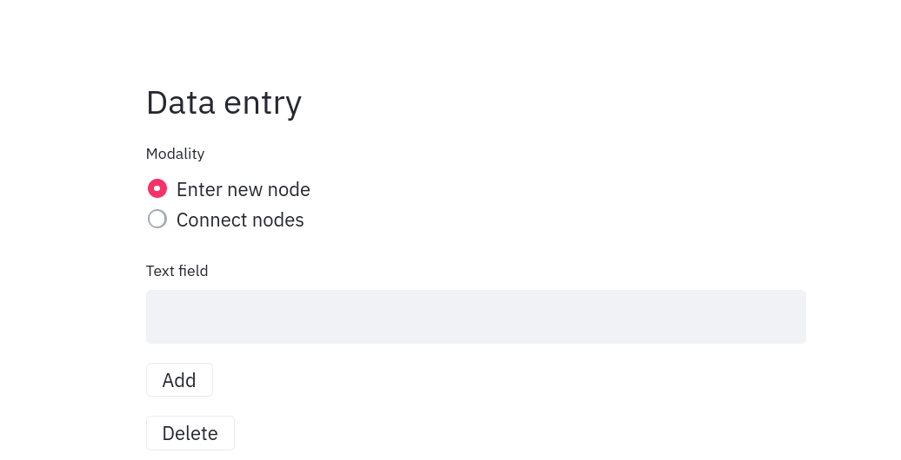
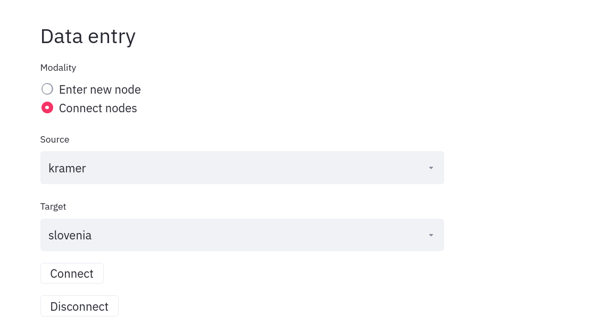
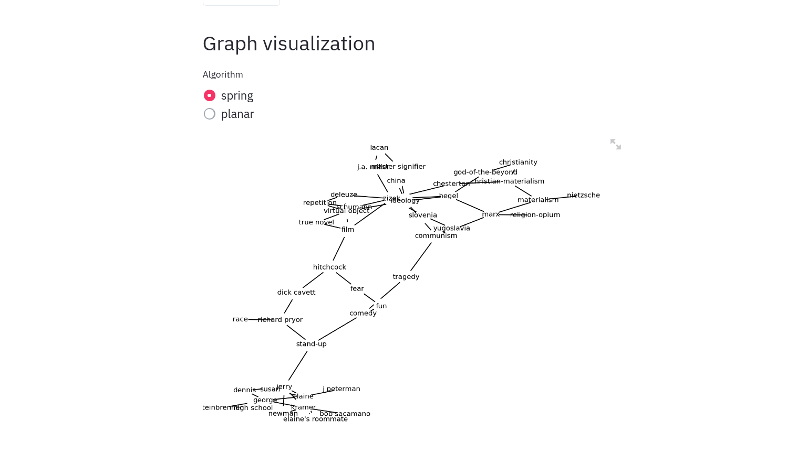
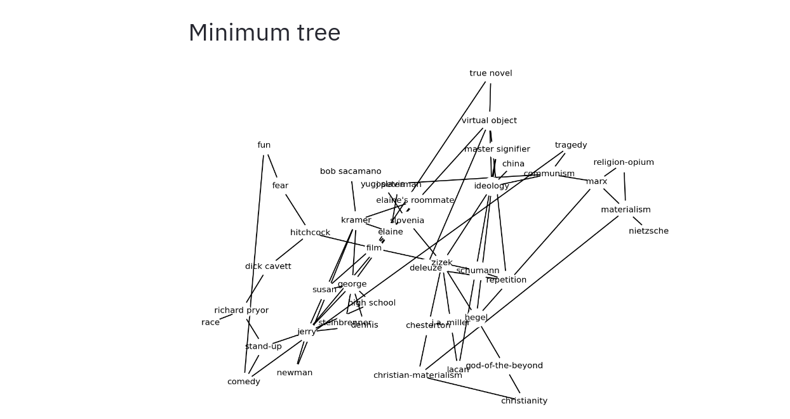
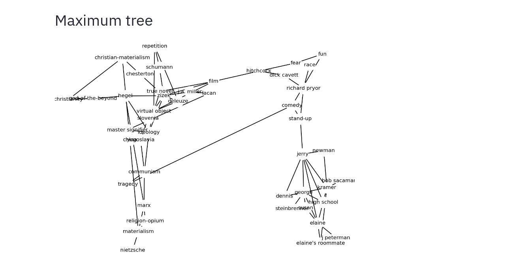

# Sursis - network notebook for personal uses

Sursis is a simple web app built on top of [Streamlit](https://streamlit.io). In a way, it abuses the goals of Streamlit, which are closer to Jupyter notebooks, but is very simply written and does the trick for me.

It is indeed so simple that it might not even qualify as a hobby project. But I managed to put it together in a few hours and it's been really interesting to jot down connections whenever watching lectures. The concept is that you have a single undirected, unweighted graph to connect across many domains. Not unlike a written personal notes.txt or outline, but not sequential and able to reach back and connect separate "moments".

Sursis runs locally; or preferrably on a cheap VPS/Digital Ocean-type VM so you'll be able to use it on your phone. 

Usage is also very simple:

## Data entry

### Node input 

### Edge/connection input

## Visualization

Visualization is provided by [networkx](https://networkx.github.io).

### Graph visualization

### Minimum and maximum spanning trees

Minimum and maximum spanning trees may give you some additional impact into your network.

