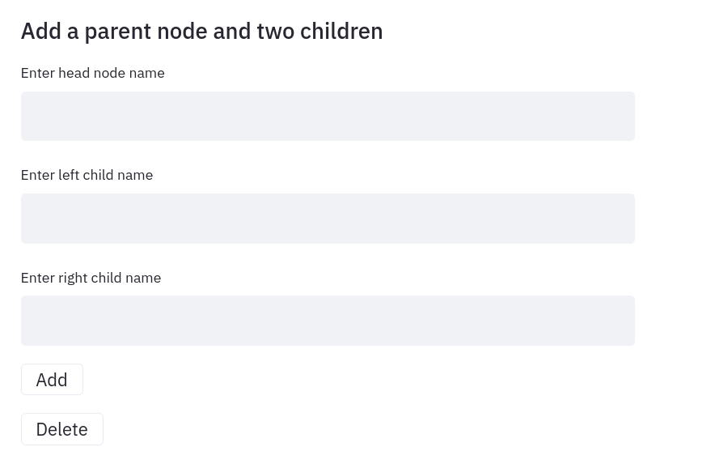

# `Sursis` - [personal] <- [notebook] -> [network]

`Sursis` is a web app built on top of [Streamlit](https://streamlit.io) (somewhat abusively). 

Its basic purpose is to have a personal notebook or journal to jot down ideas, movies or records you have recently enjoyed or pieces of information related to personal projects. 

The particular conceit of `Sursis` is that this journal is not written sequentially, but as a network/graph. (It's been recently compared to mind-mapping, but without exception every such tool seems to expect you to figure out a tree-like outline. `Sursis` is much, much more general if that's the comparison to be made).

Sursis runs locally. My personal suggestion is to set it up on a cheap VPS/Digital Ocean-type VM so you'll be able to use it on your phone. I've been having great fun with it from day zero and polishing it a little more each day.

## Input modes

The app presents you with a number of choices. 

Let us look at them a little.

Visualization lets you look at a node's immediate neighbors, in turn their neighbors and so on. We'll return to that.

"Nodes" lets you add new nodes to your notebook. Shocking, no?

"Connections" lets you add edges between nodes, i.e. connect them.

Each prompt that requires you to select an already-existing node opens up a select-box. You can type to get partial results and confirm.

With "Dyad" you can add two nodes at once and connect them. This can be done with the previous functions alone, but this is more convenient when writing stuff down quickly.

Likewise "Triad" lets you add a "tree" or "fork"-like pattern with one new node that connects to other two nodes. This again is a convenience function. 

"Trailing" lets you add a new node and connect it to an existing node.

"Merge" lets you merge two nodes and all their connections/edges. This is also useful to rename nodes.

## Visualization

You can start from any node and look at its neighborhood, 

and then the neighborhood of its neighbors,

and then the neighbors of their neighors of their neighbors.

By scrolling down you can also see the minimum spanning tree, which cuts out some edges to provide a graph without cycles.

For kicks, you can also see the full graph

as well as its minimum spanning tree:

## The coloring of nodes

The coloring of nodes is giving by a regularized least-squares solution to a Poisson equation 

    Lx = w, 

 where `w` are the observed "weights" (currently, the betweenness centrality of nodes). This, of course, is Gauss's gravity equation in natural units. In this way we expect to capture an idea of the balance of forces in the graph structures --  much beyond the 2D graph layouts that are really optimized for visualization, not insight.

Edges are also given values in a very similar way, but using the dual graph (whose nodes are the edges of the primal graph). Layout algorithms are supposed to take these values into account by making higher-valued edges visually longer. I'm not so sure about that.

## Installing

Clone the repository and create an environment

    python3 -m venv env
    source env/bin/activate
    pip install -r requirements.txt

If you don't have a preexisting notebook, run 

     python initialize_script.py

Note that for the time being the notebook is always stored as `data.sqlite`.

To run,

    streamlit run app.py

You *will* get an error in the default visualization screen with an empty notebook/graph. Just add some nodes and then connections.
